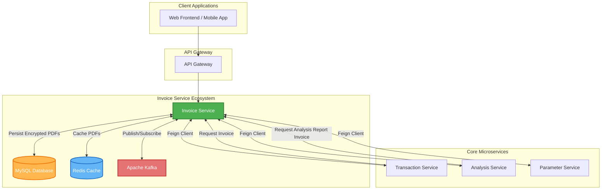
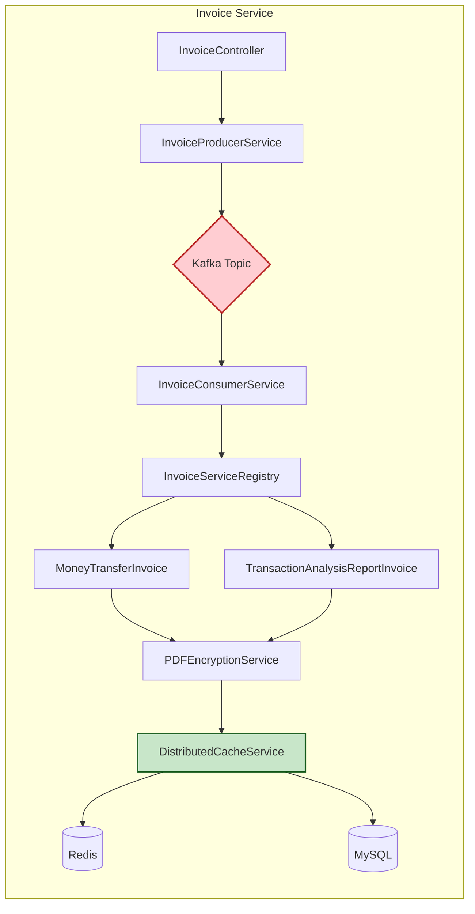
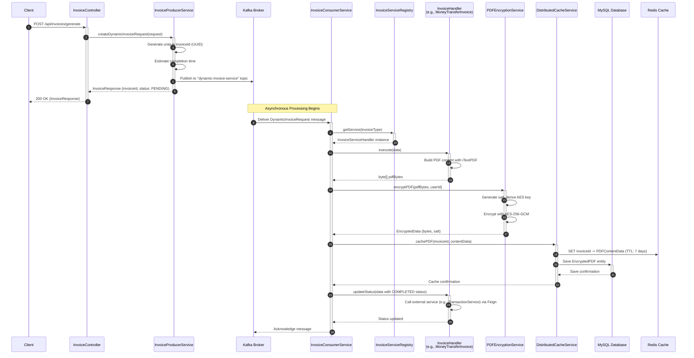
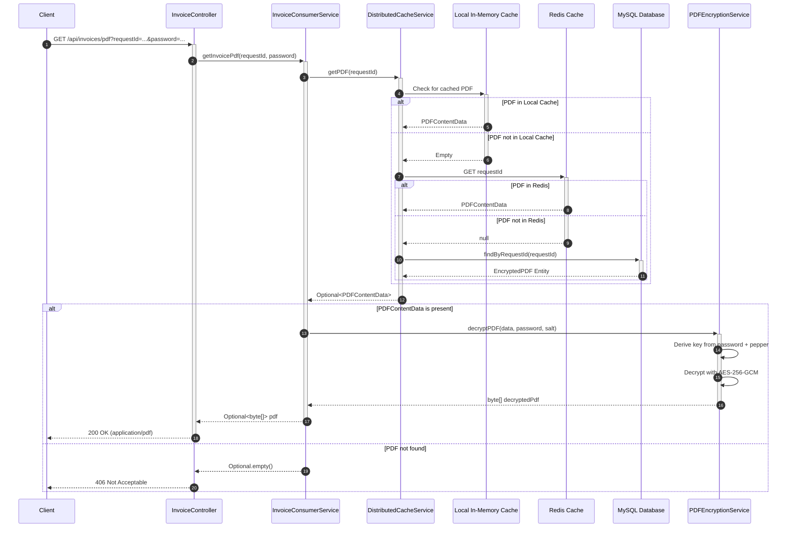
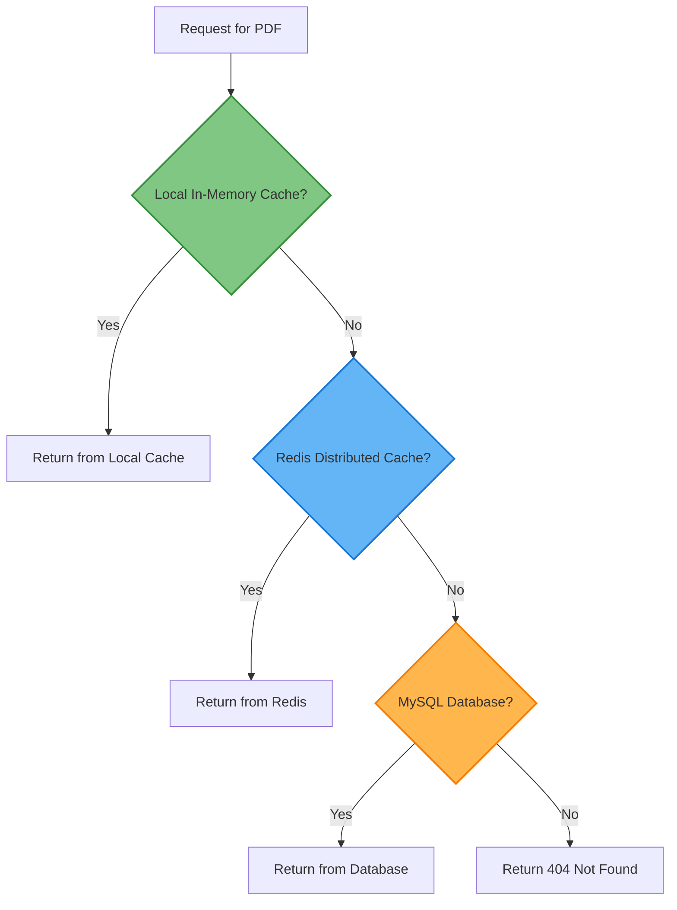
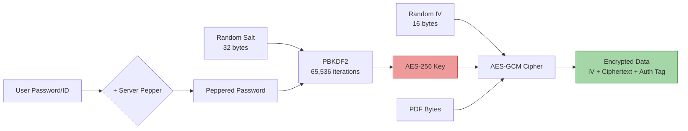

# Invoice Service

<div align="center">


**A high-performance, secure, and scalable microservice for generating, encrypting, caching, and distributing PDF invoices.**

</div>

---

## Table of Contents

- [1. Overview](#1-overview)
- [2. Key Features](#2-key-features)
- [3. System Architecture](#3-system-architecture)
  - [3.1 High-Level Architecture Diagram](#31-high-level-architecture-diagram)
  - [3.2 Component Interaction Flow](#32-component-interaction-flow)
- [4. Technology Stack](#4-technology-stack)
- [5. Invoice Generation Flow](#5-invoice-generation-flow)
  - [5.1 Asynchronous Invoice Request Flow](#51-asynchronous-invoice-request-flow)
  - [5.2 Invoice Retrieval Flow](#52-invoice-retrieval-flow)
- [6. Supported Invoice Types](#6-supported-invoice-types)
- [7. Core Components](#7-core-components)
  - [7.1 API Layer](#71-api-layer)
  - [7.2 Service Layer](#72-service-layer)
  - [7.3 Caching Strategy](#73-caching-strategy)
  - [7.4 Security & Encryption](#74-security--encryption)
- [8. Inter-Service Communication](#8-inter-service-communication)
- [9. Configuration](#9-configuration)
- [10. API Reference](#10-api-reference)
- [11. Running the Service](#11-running-the-service)
- [12. Environment Variables](#12-environment-variables)
- [13. Monitoring & Observability](#13-monitoring--observability)

---

## 1. Overview

The **Invoice Service** is a critical microservice within the `bakirwebservice` ecosystem. Its primary responsibility is to generate professional PDF documents for various financial transactions and analysis reports. The service is designed with a focus on:

- **Asynchronous Processing**: Utilizes Apache Kafka for decoupled, event-driven processing, allowing the system to handle high volumes of invoice requests without blocking.
- **Security**: Implements AES-256-GCM encryption with PBKDF2 key derivation to protect sensitive financial documents at rest.
- **Performance**: Employs a multi-tiered caching strategy using both in-memory and Redis distributed caching for fast document retrieval.
- **Extensibility**: Uses a Strategy Pattern (via `InvoiceServiceRegistry`) to easily add new invoice types without modifying core logic.

This document provides a comprehensive guide to understanding the service's architecture, components, and operational details.

---

## 2. Key Features

| Feature | Description |
| :--- | :--- |
| **Dynamic PDF Generation** | Generates rich, professionally styled PDF documents using the iTextPDF library. |
| **AES-256-GCM Encryption** | All generated PDFs are encrypted before storage to ensure data confidentiality. |
| **Kafka-Driven Processing** | Invoice generation is an asynchronous operation, triggered by Kafka messages for scalability and resilience. |
| **Multi-Tier Caching** | Implements a local (in-memory) and a distributed (Redis) cache for optimal performance. |
| **Database Persistence** | Encrypted PDFs are also persisted to a MySQL database for long-term storage and disaster recovery. |
| **Extensible Invoice Types** | A registry-based design pattern allows for easy addition of new invoice types. |
| **Inter-Service Communication** | Uses OpenFeign clients to communicate with `transaction-service`, `analysis-service`, and `parameter-service`. |
| **Observability** | Exposes Prometheus metrics and Actuator health endpoints for monitoring. |

---

## 3. System Architecture

### 3.1 High-Level Architecture Diagram

The following diagram illustrates how the Invoice Service integrates within the broader microservice ecosystem.



### 3.2 Component Interaction Flow

This diagram shows the internal components of the Invoice Service and how they interact with each other.



---

## 4. Technology Stack

The Invoice Service is built upon a robust and modern technology stack:

| Category | Technology | Purpose |
| :--- | :--- | :--- |
| **Framework** | Spring Boot 3.2.0 | Core application framework |
| **Language** | Java 17 | Primary programming language |
| **Messaging** | Apache Kafka | Asynchronous message broker for invoice requests |
| **Caching** | Spring Data Redis | Distributed caching for encrypted PDFs |
| **Database** | MySQL | Persistent storage for encrypted invoices |
| **PDF Generation** | iTextPDF 5.5.13.3 | Creating rich PDF documents |
| **Cryptography** | BouncyCastle (bcprov-jdk15on) | Enhanced security provider for encryption |
| **Inter-Service Comm** | Spring Cloud OpenFeign | Declarative REST client for calling other microservices |
| **Object Mapping** | ModelMapper 3.2.0 | Simplifies DTO to Entity mappings |
| **Resiliency** | Spring Retry | Provides retry logic for transient failures |
| **Observability** | Micrometer Prometheus Registry | Exports metrics for monitoring |

---

## 5. Invoice Generation Flow

The invoice generation process is entirely asynchronous, leveraging Apache Kafka for reliable message delivery.

### 5.1 Asynchronous Invoice Request Flow

The following sequence diagram details the step-by-step process of an invoice request from initiation to completion.



**Explanation of Asynchronous Flow:**

1.  **Request Initiation (Steps 1-7):** A client sends a request to the `InvoiceController`. The `InvoiceProducerService` generates a unique ID, publishes the request to a Kafka topic, and **immediately returns** a response to the client with a `PENDING` status. This ensures the client is not blocked.
2.  **Background Processing (Steps 8-18):** A Kafka consumer (`InvoiceConsumerService`) picks up the message. It uses the `InvoiceServiceRegistry` to find the correct handler for the invoice type (e.g., `TRANSFER` or `TRANSACTION_ANALYSIS_REPORT`). The handler generates the PDF, which is then encrypted and stored in both Redis and MySQL.
3.  **Status Update (Steps 19-21):** After successful generation and storage, the handler is called to update the status of the related entity in an external service (e.g., marking a transaction as invoiced).

### 5.2 Invoice Retrieval Flow

Once an invoice has been generated, a client can retrieve it using the generated `invoiceId`.



**Explanation of Retrieval Flow:**

1.  **Multi-Tier Cache Lookup:** The `DistributedCacheService` first checks the local in-memory cache. If not found, it checks Redis. As a final fallback, it queries the MySQL database.
2.  **Decryption:** Once the encrypted PDF data is found, the `PDFEncryptionService` decrypts it using the provided password (or user ID used as password) combined with a server-side secret ("pepper").
3.  **Response:** The decrypted PDF bytes are returned to the client with the `application/pdf` content type.

---

## 6. Supported Invoice Types

The service uses a registry-based pattern (`InvoiceServiceRegistry`) to manage different invoice types. This makes adding new types straightforward.

| Invoice Type | Handler Class | Description |
| :--- | :--- | :--- |
| `TRANSFER` | `MoneyTransferInvoice` | Generates a detailed receipt for money transfers between accounts. Includes sender/receiver details, amount, currency, and transaction metadata. |
| `TRANSACTION_ANALYSIS_REPORT` | `TransactionAnalysisReportInvoice` | Creates a comprehensive financial analysis report. Includes AI-generated summaries, risk assessments, detected patterns, and account statistics. |

**Adding a New Invoice Type:**

1.  Create a new class implementing the `InvoiceServiceHandler` interface.
2.  Implement the `execute(Map<String, Object> parameters)` method to generate the PDF.
3.  Implement the `updateStatus(Map<String, Object> parameters)` method if an external service needs to be notified.
4.  Register the new handler in the `InvoiceServiceRegistry` constructor.

```java
// InvoiceServiceRegistry.java
public InvoiceServiceRegistry(MoneyTransferInvoice moneyTransferInvoice,
                              TransactionAnalysisReportInvoice transactionAnalysisReportInvoice,
                              MyNewInvoiceHandler myNewInvoiceHandler) { // Add new handler
    registerService("TRANSFER", moneyTransferInvoice);
    registerService("TRANSACTION_ANALYSIS_REPORT", transactionAnalysisReportInvoice);
    registerService("MY_NEW_TYPE", myNewInvoiceHandler); // Register it
}
```

---

## 7. Core Components

### 7.1 API Layer

The API layer exposes RESTful endpoints for interacting with the Invoice Service.

| Class | Path | Description |
| :--- | :--- | :--- |
| `InvoiceController` | `/api/invoices` | Main controller for invoice operations. |
| `CacheController` | `/api/cache` | Utility controller for cache management (e.g., clearing cache). |

**Key Endpoints on InvoiceController:**

-   `POST /generate`: Submits a `DynamicInvoiceRequest` to the Kafka queue for asynchronous generation.
-   `GET /pdf`: Retrieves and decrypts a generated PDF by its `requestId` and `password`.
-   `POST /invoice`: Retrieves a PDF using a `GetInvoicePDFRequest` body.

### 7.2 Service Layer

The service layer contains the core business logic.

| Service | Responsibility |
| :--- | :--- |
| `InvoiceProducerServiceImpl` | Publishes invoice generation requests to the Kafka topic. Estimates completion time. |
| `InvoiceConsumerService` | Consumes messages from Kafka, orchestrates PDF generation, encryption, and caching. |
| `InvoiceServiceRegistry` | Manages and provides access to specific `InvoiceServiceHandler` implementations based on invoice type. |
| `MoneyTransferInvoice` | Generates the PDF for money transfer receipts. |
| `TransactionAnalysisReportInvoice` | Generates the PDF for financial analysis reports. |
| `PDFEncryptionServiceImpl` | Encrypts and decrypts PDF byte arrays using AES-256-GCM. |
| `LoadEstimatorService` | Estimates the time required to process an invoice request. |

### 7.3 Caching Strategy

A multi-tiered caching strategy is employed for optimal performance and resilience.



| Tier | Store | TTL | Purpose |
| :--- | :--- | :--- | :--- |
| **L1** | Local In-Memory (`ConcurrentHashMap`) | Session/Request-based | Fastest access for recently requested PDFs. |
| **L2** | Redis | 7 Days | Distributed cache shared across service instances. |
| **L3** | MySQL Database | Permanent | Long-term persistence, source of truth. |

**`DistributedCacheService`** manages this flow, checking L1, then L2, then L3.

### 7.4 Security & Encryption

Security is a paramount concern for a service handling financial documents.

**Encryption Details (`PDFEncryptionServiceImpl`):**

| Parameter | Value | Description |
| :--- | :--- | :--- |
| **Algorithm** | `AES/GCM/NoPadding` | Advanced Encryption Standard in Galois/Counter Mode. GCM provides both encryption and authentication. |
| **Key Length** | 256 bits | Strong key length for AES. |
| **Key Derivation** | `PBKDF2WithHmacSHA256` | Password-Based Key Derivation Function 2. Derives a cryptographic key from a password. |
| **Iteration Count** | 65,536 | Number of iterations for PBKDF2, slowing down brute-force attacks. |
| **Salt Length** | 32 bytes | Random salt generated for each encryption, stored alongside the encrypted data. |
| **IV Length** | 16 bytes | Initialization Vector for AES-GCM. |
| **Pepper** | Environment Variable | A secret server-side string added to the password before key derivation, stored separately from the salt. |

**Encryption Flow:**



---

## 8. Inter-Service Communication

The Invoice Service communicates with other microservices using declarative **OpenFeign** clients.

| Feign Client | Target Service | Purpose |
| :--- | :--- | :--- |
| `AnalysisServiceClient` | `analysis-service` | Updates the analysis report record with the generated `invoiceId`. |
| `TransactionServiceClient` | `transaction-service` | Updates the transaction record's invoice status to `COMPLETED`. |
| `ParameterServiceClient` | `parameter-service` | Fetches error codes and logs errors for centralized error management. |

**Example: `TransactionServiceClient`**

```java
@FeignClient(name = "transaction-service", url = "${feign.client.transaction-service.url}")
public interface TransactionServiceClient {

    @PostMapping("${feign.client.transaction-service.updateTransactionInvoiceStatus}")
    BaseResponse updateTransactionInvoiceStatus(@RequestBody UpdateTransactionInvoiceStatus request);
}
```

---

## 9. Configuration

The service is configured via `application.yml` and environment variables.

**Key Configuration Areas:**

-   **Server Port:** `8050`
-   **Database:** MySQL connection configured via environment variables.
-   **Kafka:** Bootstrap servers for producer and consumer.
-   **Redis:** Host, port, and password for the distributed cache.
-   **Feign Clients:** Base URLs for dependent microservices.
-   **Encryption:** Pepper value from environment variable.
-   **Caching:** TTL (Time-To-Live) for cache entries.

---

## 10. API Reference

### Generate Invoice

Creates a request for asynchronous invoice generation.

-   **Endpoint:** `POST /api/invoices/generate`
-   **Request Body:** `DynamicInvoiceRequest`

    ```json
    {
      "userId": "user-uuid-123",
      "invoiceType": "TRANSFER",
      "date": "2026-01-03T10:00:00",
      "data": {
        "senderName": "John Doe",
        "receiverName": "Jane Doe",
        "amount": "1500.00",
        "currency": "TRY"
        // ... other type-specific fields
      }
    }
    ```

-   **Response:** `InvoiceResponse`

    ```json
    {
      "requestId": "generated-uuid-456",
      "invoiceType": "TRANSFER",
      "invoiceStatus": "PENDING",
      "requestTime": "2026-01-03T10:00:00",
      "estimatedCompletionDate": "2026-01-03T10:00:05"
    }
    ```

### Get Invoice PDF

Retrieves and decrypts a generated PDF.

-   **Endpoint:** `GET /api/invoices/pdf`
-   **Query Parameters:**
    -   `requestId` (String): The unique ID returned from the generate call.
    -   `password` (String): The password/userId used to encrypt the PDF.
-   **Response:**
    -   `200 OK`: `application/pdf` (binary PDF content)
    -   `406 Not Acceptable`: Invoice not ready or not found.
    -   `500 Internal Server Error`: Decryption or other server error.

---

## 11. Running the Service

### Prerequisites

-   Java 17+
-   Maven 3.8+
-   Running instances of: MySQL, Redis, Apache Kafka.
-   Access to `analysis-service`, `transaction-service`, `parameter-service`.

### Build

```bash
mvn clean package -DskipTests
```

### Run Locally

```bash
java -jar target/invoiceservice-0.0.1-SNAPSHOT.jar
```

### Run with Docker

```bash
# Build the Docker image
docker build -t invoice-service:latest .

# Run the container
docker run -d -p 8050:8050 \
  -e DATABASE_URL="jdbc:mysql://host:3306/db" \
  -e DATABASE_USERNAME="user" \
  -e DATABASE_PASSWORD="pass" \
  -e KAFKA_BOOTSTRAP_SERVERS="kafka:9092" \
  -e REDIS_HOST="redis" \
  -e REDIS_PORT="6379" \
  -e REDIS_PASSWORD="" \
  -e ENCRYPTION_PEPPER="your-secret-pepper" \
  # ... other service URLs
  invoice-service:latest
```

---

## 12. Environment Variables

The following environment variables must be configured:

| Variable | Description | Example |
| :--- | :--- | :--- |
| `DATABASE_URL` | JDBC connection string for MySQL. | `jdbc:mysql://localhost:3306/invoicedb` |
| `DATABASE_USERNAME` | Database username. | `root` |
| `DATABASE_PASSWORD` | Database password. | `password` |
| `KAFKA_BOOTSTRAP_SERVERS` | Kafka broker address(es). | `localhost:9092` |
| `REDIS_HOST` | Redis server hostname. | `localhost` |
| `REDIS_PORT` | Redis server port. | `6379` |
| `REDIS_PASSWORD` | Redis password (can be empty). | `` |
| `ENCRYPTION_PEPPER` | Secret value for PBKDF2 key derivation. **Keep this secret!** | `a-very-long-and-random-string` |
| `TRANSACTION_SERVICE_URL` | Base URL for Transaction Service. | `http://localhost:8040` |
| `ANALYSIS_SERVICE_URL` | Base URL for Analysis Service. | `http://localhost:8060` |
| `PARAMETER_SERVICE_URL` | Base URL for Parameter Service. | `http://localhost:8030` |

---

## 13. Monitoring & Observability

The service exposes standard Spring Boot Actuator endpoints for health checks and Prometheus-compatible metrics.

| Endpoint | Description |
| :--- | :--- |
| `/actuator/health` | Health status of the service and its dependencies. |
| `/actuator/metrics` | All available metrics. |
| `/actuator/prometheus` | Metrics in Prometheus format for scraping. |
| `/actuator/circuitbreakers` | Status of any configured circuit breakers. |

**Logging:**
The service uses a structured logging pattern that includes a `traceId` for distributed tracing, making it easy to correlate logs across multiple services.

```
2026-01-03 10:18:40 INFO  [trace-id-abc] c.b.i.s.i.InvoiceConsumerService - Consumed dynamic invoice: ...
```

---

<div align="center">
<sub>Built with ❤️ by Bakirwebservice Team</sub>
</div>
